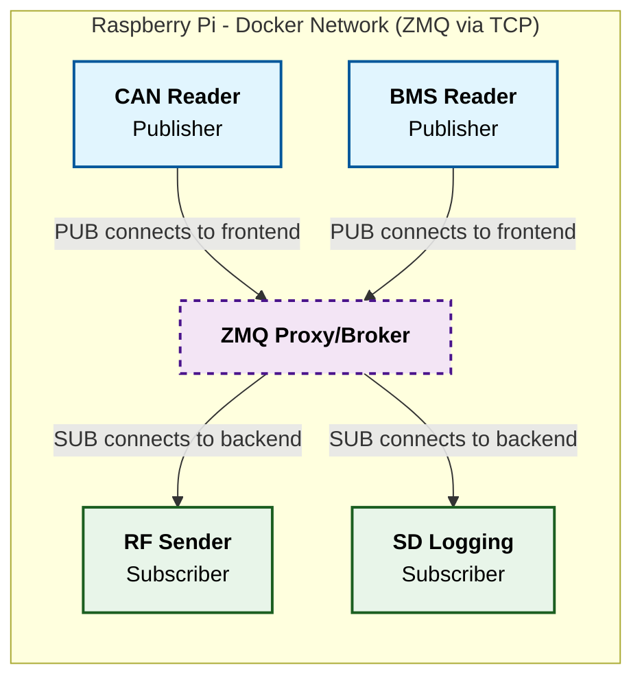

# Wireless Telemetry

Runs on Raspberry Pi 5.

## 5 Containerized Processes:
- CAN Reading
- RF Sending
- SD Logging
- BMS Reading
- Broker



Orchestrated with Docker Compose.
Communicating with TCP, ZeroMQ Pub/Sub Protocol broker.

## Remote Development:
If on Unix system (MacOS / Linux) I recommend using plain `rsync` for quick iterations. And then `git pull` for finalised versions of code / closing out of pi.
- Remember to keep the pi up to date with git repo. If testing new code on the pi unless it is pushed to git hub, finish your coding session with a clean `git pull` on the pi.

`cd Wireless-telem`
Then run rsync command:
`rsync -avz --exclude-from='.gitignore' --exclude='.git' . mur@mur-wireless-telemetry:~/Wireless-telem`


## Developent without a Raspi 
Use orbstack as a linux vm. build with `docker compose --profile dev build --no-cache` run with `docker compose --profile dev up`. enable vcan0 with:
```bash
docker run --rm \
    --network host \
    --privileged \
    alpine sh -c '
      apk add --no-cache iproute2 &&
      modprobe vcan || true &&
      ip link add dev vcan0 type vcan &&
      ip link set up vcan0
    '```
